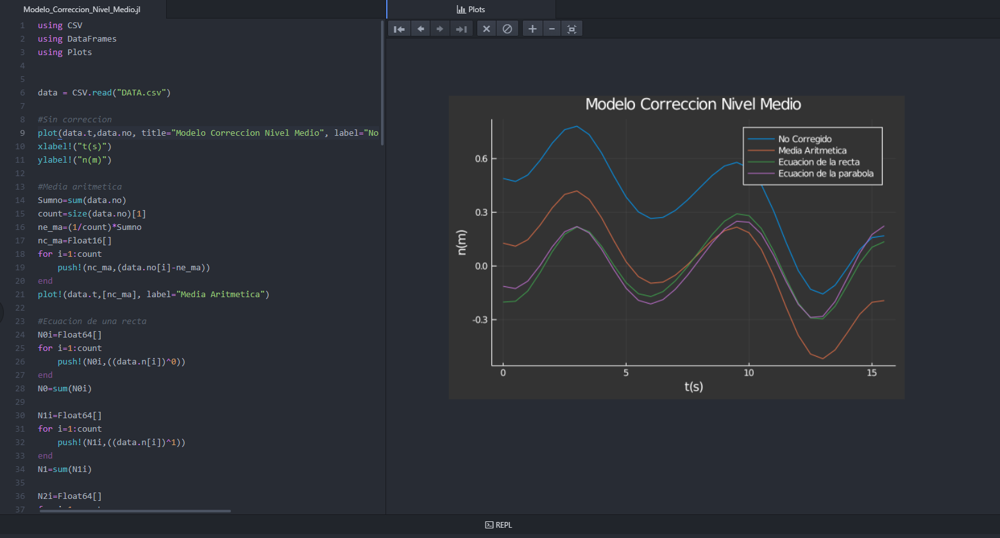

# Modelo Correccion Nivel Medio y Caracterizacion del oleaje _ Rios y Costas

En el presente repositorio se presentan tres modelos de correccion del nivel medio:

1_ Media aritmetica
2_ Ecuacion de la recta
3_ Ecuacion de la parabola

Ademas proporciona la caraterizacion del oleaje para cada correccion

Los datos de entrada se encuentran en el archivo DATA.csv .El ecabezado está definido por n;t;no  donde "n" es el id de la muestra, "t" es el tiempo en segundos y "no" es el nivel en metros. En este archivo se debe guardar los datos si se desea correr el modelo, actualmente se encuentra precargado un ejemplo guia.

En el archivo DATA.xlsx se encuentra desarrollado un ejemplo guia tomado del libro "Analisis y descripcion estadistica del oleaje" por Rodolfo Silva Casarín

